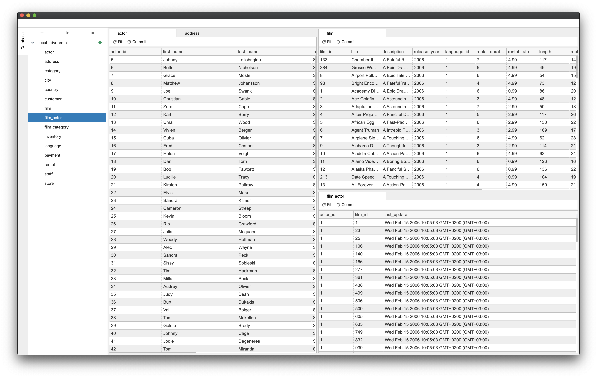

# Mochi

Mochi is a Chrome application for interacting with various databases. Currently, it is a proof of concept
with PostgreSQL support with more integrations planned in near future.



## Prerequisites

* [node + yarn](https://nodejs.org/) (Current Version)

## Project Structure

Uses `Phosphorjs` for application base. Application structure is heavily
inspired from [Jupyterlab](https://github.com/jupyterlab/jupyterlab).

`src` directory includes the source code for the application. Application is split into so called extensions, where each
extension has a specific purpose. Extensions can depend each other using phosphor extension system.

Extension system might look overwhelming at first sight, but it makes architecture simpler on scale at a cost of
minimum code repetition. Extensions should be considered as 3rd parties, which means they should only use public
APIs exposed by each extension.

UI uses phosphor widgets for layouting and React for rendering.

For more reference about architecture please refer to
[Jupyterlab Development Guide](https://jupyterlab.readthedocs.io/en/stable/developer/extension_dev.html).

## Setup

```
yarn
```

## Build in watch mode

### terminal

```
yarn watch
```

## Load extension to chrome

Load `dist` directory

